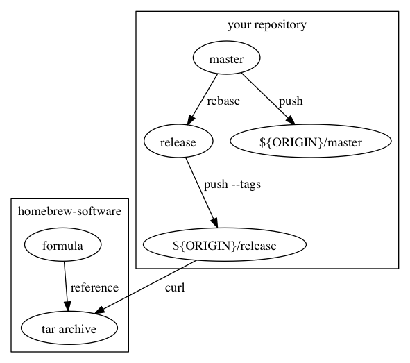
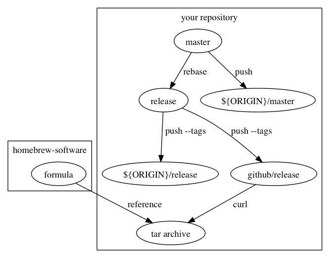

# mulle-homebrew

A convenience script to tag and release something and publish it to
a homebrew tap.

It is assumed, that you keep your version in a header file,
in this major.minor.patch format:

```
#define MY_VERSION  ((1 << 20) | (7 << 8) | 10)
```

In the simple scenario, you are pushing to one host and serving your archive
for homebrew from there:




In the more complex scenarion, you have a remote called **github** and you
push your release branch their and serve the archive from github:




## Setting up the simple scenario

Install into local project `./bin` directory

```
echo "https://www.mulle-kybernetik.com/repositories/mulle-homebrew;bin/mulle-homebrew" >> .bootstrap/embedded_repositories
mulle-build
```

Create a `release.sh` script in `./bin`  (to be executed from project root)

```
PROJECT="MyProject"      # your project name, requires camel-case
DESC="MyProject does this and that"
DEPENDENCIES="libz
cmake"                   # list brew dependencies
ORIGIN=public            # git repo to push to
LANGUAGE=c               # c,cpp, objc of the header file

# source mulle-homebrew.sh (clumsily)

. ./bin/mulle-homebrew/mulle-homebrew.sh

# parse options
homebrew_parse_options "$@"

# dial past options
while [ $# -ne 0 ]
do
   case "$1" in
      -*)
         shift
      ;;
      *)
         break;
      ;;
   esac
done


#
# these can usually be deduced, if you follow the conventions
#
NAME="`get_name_from_project "${PROJECT}" "${LANGUAGE}"`"
HEADER="`get_header_from_name "${NAME}"`"
VERSIONNAME="`get_versionname_from_project "${PROJECT}"`"
VERSION="`get_header_version "${HEADER}" "${VERSIONNAME}"`"


# --- HOMEBREW FORMULA ---
# Information needed to construct a proper brew formula
#
HOMEPAGE="https://www.mulle-kybernetik.com/software/git/${NAME}"
ARCHIVEURL='https://www.mulle-kybernetik.com/software/git/${NAME}/tarball/${VERSION}'  # ARCHIVEURL will be evaled later! keep it in single quotes


# --- HOMEBREW TAP ---
# Specify to where and under what bame to publish via your brew tap
#
RBFILE="${NAME}.rb"                    # ruby file for brew
HOMEBREWTAP="../homebrew-software"     # your tap repository path


# --- GIT ---
# tag to tag your release
# and the origin where
TAG="${1:-${TAGPREFIX}${VERSION}}"


main()
{
   git_main "${ORIGIN}" "${TAG}" || exit 1
   homebrew_main
}

main "$@"
```

Then make it executable and execute


```
chmod 755 ./bin/release.sh
./bin/release.sh  # sic!
```


